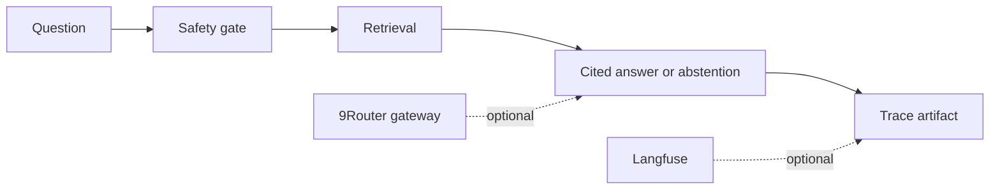

# AI platform RAG observability

A local, cited RAG reference that separates retrieval, safety behavior, response generation, and trace capture. It runs with a deterministic fixture corpus and exposes the integration boundaries for 9Router as a gateway and Langfuse as an observability backend.



## Local proof

```powershell
python -m unittest discover -s tests -v
python -m rag_platform --corpus data\corpus_fixture.json --question "How does the retrieval service abstain?" --output artifacts\result.json
```

The service returns citations for retrieved answers, abstains when no approved evidence matches, and refuses recognized prompt-injection patterns. The output carries a trace ID, outcome, citation count, and safety reason.

## Integration boundary

9Router and Langfuse remain optional external services. This repository does not bundle their code, credentials, or deployment configuration. A deployment adapter must supply its own endpoint, access controls, retention policy, and trace redaction rules.

## Limitations

The fixture corpus and deterministic answer path demonstrate control flow, not model quality. The project makes no claim about production latency, provider availability, retrieval recall, or safety coverage beyond the tested cases.
