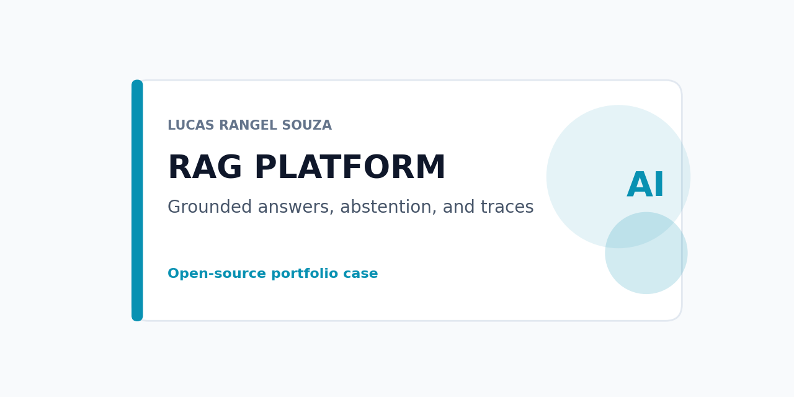
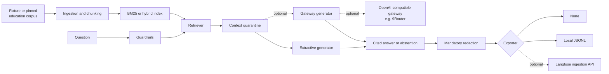

# AI platform RAG observability



A cited retrieval-augmented generation reference with an OpenAI-compatible gateway client, Langfuse-shaped redacted traces, and an education-demo corpus built from a pinned public dataset. It runs locally with no provider account and no Kaggle credential.

## Architecture



*Alt text: a fixture or pinned education corpus is chunked and indexed; a question passes guardrails, retrieval, and context quarantine into an extractive or optional gateway generator, producing a cited answer or abstention that is redacted before export to no sink, a local file, or an optional Langfuse endpoint.*

## Capabilities and non-goals

Implemented and tested (118 unit tests):

- source-attributed ingestion with deterministic, id-stable chunking ([ingestion.py](rag_platform/ingestion.py));
- BM25 retrieval, a deterministic local hashing embedder, and hybrid re-ranking ([retrieval.py](rag_platform/retrieval.py));
- prompt-injection and out-of-scope guardrails, abstention when no chunk matches ([guardrails.py](rag_platform/guardrails.py));
- an extractive generator (no provider) and an optional gateway generator that can only cite chunk ids retrieval actually returned ([generation.py](rag_platform/generation.py));
- an OpenAI-compatible gateway client: ordered routes, retry with backoff on 429/5xx/timeouts, no retry on other 4xx, error classification, per-call token and cost attribution ([gateway.py](rag_platform/gateway.py), tested against a fake in-process HTTP server, no real provider);
- Langfuse-shaped traces (trace, retrieval span, generation observation) with mandatory redaction before export; exporters are none (default), local JSONL, and a Langfuse ingestion-API client tested against a fake in-process server ([observability.py](rag_platform/observability.py));
- an education corpus adapter pinned to `lucasrangelss/brazil-education-data-lake` v1 by manifest SHA-256; it verifies every file, rejects unknown columns and person-level fields, and builds one cited document per municipality plus a dataset-card document ([education_corpus.py](rag_platform/education_corpus.py));
- a JSON API (`POST /v1/answer`, `GET /healthz`) and CLI subcommands `answer`, `evaluate`, `serve` ([api.py](rag_platform/api.py), [__main__.py](rag_platform/__main__.py));
- offline recall@k, citation coverage, and abstention-rate evaluation ([evaluation.py](rag_platform/evaluation.py));
- a Dockerfile (non-root, digest-pinned base, health check) and Compose `fixture`/`education` profiles.

Not provided: a real 9Router or Langfuse deployment (only their public HTTP contracts, exercised against fake servers), production latency or safety-coverage claims, lexical retrieval beyond BM25/hybrid, a vector database.

## Quick start

Python 3.10+. No provider account or Kaggle credential is needed for the default path.

```powershell
python -m pip install -e .
make check
python -m rag_platform answer --question "How does the retrieval service abstain?" --output artifacts\result.json
python -m rag_platform evaluate --output artifacts\eval-fixture.json
python -m rag_platform serve --port 8080
```

To run against the real public education release instead of the fixture, extract [the dataset](https://www.kaggle.com/datasets/lucasrangelss/brazil-education-data-lake) (or use `kagglehub.dataset_download('lucasrangelss/brazil-education-data-lake/versions/1')`) and pass `--education-dir <path>` to `answer`, `evaluate`, or `serve`.

### Docker

```powershell
docker build -t rag-platform:0.2.0 .
docker compose --profile fixture up -d      # http://127.0.0.1:8080
# or, with the real release extracted locally:
EDUCATION_RELEASE_DIR=<path> docker compose --profile education up -d   # http://127.0.0.1:8081
```

## Repository structure

```text
rag_platform/       ingestion, retrieval, guardrails, generation, gateway, observability, education corpus, API, CLI
data/                synthetic fixture corpus and evaluation cases
tests/               unit tests, including fake in-process gateway and Langfuse servers
docs/                ADRs, threat model, reproduce guide, dated evidence
articles/            article draft and claim map
```

## Data, licensing, and privacy

The fixture corpus is synthetic text written for this repository. The education corpus adapter reads only the pinned, hash-verified `brazil-education-data-lake` release (see [brazil-public-data-map](https://github.com/LucasRangelSSouza/brazil-public-data-map)); it has no personal data. Traces redact the question (SHA-256 only) and drop passage/answer text unless `--trace-include-content` is set explicitly. Apache-2.0 covers this repository's code.

## Evaluation

From the [2026-09-25 run](docs/evidence/v0.2.0-local-run-2026-09-25.md):

| Corpus | recall@3 | citation coverage | abstention rate | n |
|---|---:|---:|---:|---:|
| Synthetic fixture (6 docs) | 1.000 | 1.000 | 1.000 | 6 + 6 |
| Real education release, 40 sampled municipalities | 0.988 | 0.938 | 1.000 | 81 + 6 |

These numbers describe the tested cases only; they are not a production retrieval-quality claim.

## Testing and CI

`make check` runs 118 unit tests. CI runs them on Python 3.12 and builds and smoke-tests the container image.

## Deployment

Optional. The Dockerfile and Compose profiles run locally with no cloud account. A public demo composition, if built, lives in `distributed-agent-runtime-lab`, not here.

## Trade-offs and limitations

BM25 and a deterministic hashing embedder are not a production embedding model. The gateway and Langfuse clients are tested against fake servers, not a pinned live instance — see [ADR 0002](docs/adr/0002-gateway-and-observability-boundary.md) for what that does and does not prove. Education citation coverage (0.938) trails recall (0.988) on the sampled evaluation; the extractive generator's sentence selection does not always carry a citation to the right document even when retrieval found it.

## Security and responsible use

Guardrails refuse recognized prompt-injection patterns and treat passage text as data, never instructions (see [generation.py](rag_platform/generation.py) system prompt). Traces are redacted by default. No credential is required for the default path; gateway and Langfuse credentials are read from environment variables at call time and never logged. See [docs/threat-model.md](docs/threat-model.md) and [SECURITY.md](SECURITY.md).

## Replication and evidence

[docs/reproduce.md](docs/reproduce.md) gives the full command sequence and expected artifacts. [docs/evidence/v0.2.0-local-run-2026-09-25.md](docs/evidence/v0.2.0-local-run-2026-09-25.md) is the dated record behind the numbers above.

## Articles

[Observable RAG without unsupported answers](articles/observable-rag-without-unsupported-answers.md) and its [claim-to-evidence map](articles/claim-map.md) are drafts for later manual publication.

## Roadmap

- Run the gateway and Langfuse clients against a pinned live instance and record a dated evidence file.
- Investigate the citation-coverage gap on the education evaluation.
