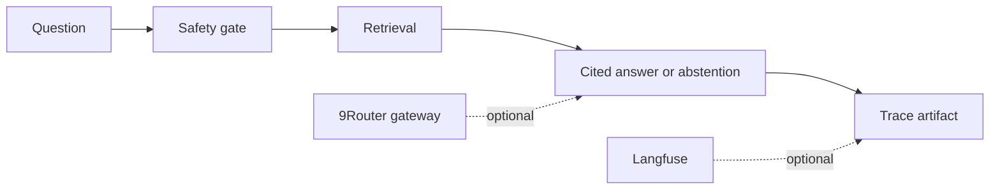

# AI platform RAG observability


A local, cited RAG reference that separates retrieval, safety behavior, response generation, and trace capture. It runs with a deterministic fixture corpus and exposes the integration boundaries for 9Router as a gateway and Langfuse as an observability backend.



## Local proof

```powershell
make check
python -m rag_platform --corpus data\corpus_fixture.json --question "How does the retrieval service abstain?" --output artifacts\result.json
python -m rag_platform --corpus data\corpus_fixture.json --question "How does the retrieval service abstain?" --evaluation-cases data\evaluation_fixture.json --output artifacts\evaluation-result.json
```

The service returns citations for retrieved answers, abstains when no approved evidence matches, and refuses recognized prompt-injection patterns. The output carries a trace ID, outcome, citation count, and safety reason.

The labeled two-case fixture reports `recall@2 = 1.0` and citation coverage `1.0`. Those values verify the current deterministic fixture only; they do not establish production retrieval quality.

Pass `--trace-output artifacts\traces.jsonl` to append a local metadata-only trace. It records the gateway label, outcome, citation document IDs, and a SHA-256 digest of the question. It does not write the raw question or answer to the trace sink.

## Integration boundary

9Router and Langfuse remain optional external services. This repository does not bundle their code, credentials, or deployment configuration. A deployment adapter must supply its own endpoint, access controls, retention policy, and trace redaction rules.

## Limitations

The fixture corpus and deterministic answer path demonstrate control flow, not model quality. The project makes no claim about production latency, provider availability, retrieval recall, or safety coverage beyond the tested cases.

## Article draft

[Observable RAG without unsupported answers](articles/observable-rag-without-unsupported-answers.md) and its [claim-to-evidence map](articles/claim-map.md) are Markdown drafts for later manual publication.
