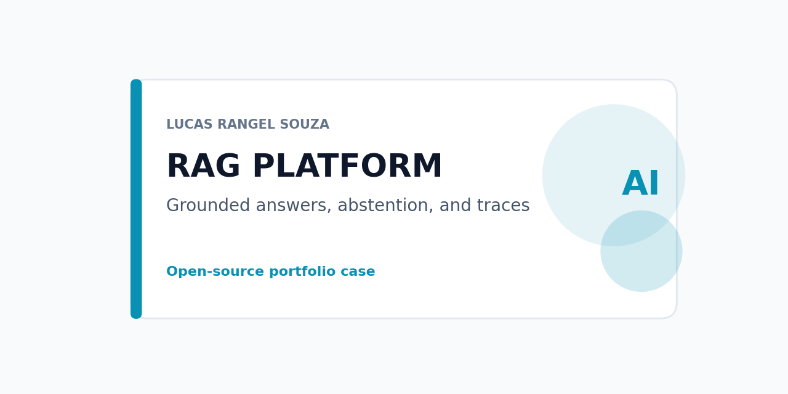
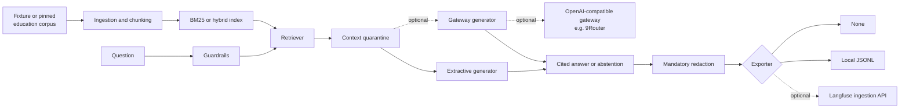

# AI platform RAG observability



A cited retrieval-augmented generation reference with an OpenAI-compatible gateway client, Langfuse-shaped redacted traces, and an education-demo corpus built from a pinned public dataset. It runs locally with no provider account and no Kaggle credential.

## Architecture


```mermaid
flowchart LR
    D[Fixture or pinned<br/>education corpus] --> I[Ingestion and chunking]
    I --> V[BM25 or hybrid index]
    U[Question] --> G[Guardrails]
    G --> R[Retriever]
    V --> R
    R --> Q[Context quarantine]
    Q --> X[Extractive generator]
    Q -. optional .-> GW[Gateway generator]
    GW -. optional .-> OR[OpenAI-compatible gateway<br/>e.g. 9Router]
    X --> A[Cited answer or abstention]
    GW --> A
    A --> RED[Mandatory redaction]
    RED --> E{Exporter}
    E --> N[None]
    E --> J[Local JSONL]
    E -. optional .-> LF[Langfuse ingestion API]
```

*Alt text: the service chunks and indexes a fixture or pinned education corpus. It checks each question, retrieves and quarantines context, then uses an extractive or optional gateway generator. The service returns a cited answer or abstention and redacts traces before exporting them to no sink, a local file, or an optional Langfuse endpoint.*

## Capabilities and non-goals

Implemented and tested (124 unit tests):

- source-attributed ingestion with deterministic, id-stable chunking ([ingestion.py](rag_platform/ingestion.py));
- BM25 retrieval, a deterministic local hashing embedder, and hybrid re-ranking ([retrieval.py](rag_platform/retrieval.py));
- prompt-injection and out-of-scope guardrails, abstention when no chunk matches ([guardrails.py](rag_platform/guardrails.py));
- language-matched gateway instructions plus deterministic English and Brazilian Portuguese refusal and abstention messages ([generation.py](rag_platform/generation.py), [language.py](rag_platform/language.py));
- an extractive generator (no provider) and an optional gateway generator that cites only chunk ids returned by retrieval ([generation.py](rag_platform/generation.py));
- an OpenAI-compatible gateway client: ordered routes, retry with backoff on 429/5xx/timeouts, no retry on other 4xx, error classification, per-call token and cost attribution ([gateway.py](rag_platform/gateway.py), tested against a fake in-process HTTP server, no real provider);
- Langfuse-shaped traces (trace, retrieval span, generation observation) with mandatory redaction before export; exporters are none (default), local JSONL, and a Langfuse ingestion-API client tested against a fake in-process server ([observability.py](rag_platform/observability.py));
- an education corpus adapter pinned to `lucasrangelss/brazil-education-data-lake` v1 by manifest SHA-256; it verifies every file, rejects unknown columns and person-level fields, and builds one cited document per municipality plus a dataset-card document ([education_corpus.py](rag_platform/education_corpus.py));
- a JSON API (`POST /v1/answer`, `GET /healthz`) and CLI subcommands `answer`, `evaluate`, `serve` ([api.py](rag_platform/api.py), [__main__.py](rag_platform/__main__.py));
- offline recall@k, citation coverage, and abstention-rate evaluation ([evaluation.py](rag_platform/evaluation.py));
- a Dockerfile (non-root, digest-pinned base, health check) and Compose `fixture`/`education` profiles.

Not provided: a real 9Router or Langfuse deployment (only their public HTTP contracts, exercised against fake servers), production latency or safety-coverage claims, lexical retrieval beyond BM25/hybrid, a vector database.

The optional gateway prompt asks the model to answer in the question's language. The service localizes its fixed refusal and abstention messages in English and Brazilian Portuguese. The extractive generator keeps the source sentence's language. The repository has not validated language compliance against a live model endpoint.

## Quick start

Python 3.10+. The default path runs without a provider account or Kaggle credential.

```powershell
python -m pip install -e .
make check
python -m rag_platform answer --question "How does the retrieval service abstain?" --output artifacts\result.json
python -m rag_platform evaluate --output artifacts\eval-fixture.json
python -m rag_platform serve --port 8080
```

To run against the real public education release instead of the fixture, extract [the dataset](https://www.kaggle.com/datasets/lucasrangelss/brazil-education-data-lake) (or use `kagglehub.dataset_download('lucasrangelss/brazil-education-data-lake/versions/1')`) and pass `--education-dir <path>` to `answer`, `evaluate`, or `serve`.

### Docker

```powershell
docker build -t rag-platform:0.2.0 .
docker compose --profile fixture up -d      # http://127.0.0.1:8080
# or, with the real release extracted locally:
EDUCATION_RELEASE_DIR=<path> docker compose --profile education up -d   # http://127.0.0.1:8081
```

## Repository structure

```text
rag_platform/       ingestion, retrieval, guardrails, generation, gateway, observability, education corpus, API, CLI
data/                synthetic fixture corpus and evaluation cases
tests/               unit tests, including fake in-process gateway and Langfuse servers
docs/                ADRs, threat model, reproduce guide, dated evidence
articles/            article draft and claim map
```

## Data, licensing, and privacy

The project uses synthetic fixture text. Its education corpus adapter reads only the pinned, hash-verified `brazil-education-data-lake` release (see [brazil-public-data-map](https://github.com/LucasRangelSSouza/brazil-public-data-map)); that release contains no personal data. Traces store only a SHA-256 digest of the question and omit passage and answer text unless a caller explicitly sets `--trace-include-content`. Apache-2.0 covers this repository's code.

## Evaluation

From the [2026-09-25 run](docs/evidence/v0.2.0-local-run-2026-09-25.md):

| Corpus | recall@3 | citation coverage | abstention rate | n |
|---|---:|---:|---:|---:|
| Synthetic fixture (6 docs) | 1.000 | 1.000 | 1.000 | 6 + 6 |
| Real education release, 40 sampled municipalities | 0.988 | 0.938 | 1.000 | 81 + 6 |

These numbers describe the tested cases only; they are not a production retrieval-quality claim.

## Testing and CI

`make check` runs 124 unit tests. CI runs them on Python 3.12 and builds and smoke-tests the container image.

## Deployment

Optional. The Dockerfile and Compose profiles run locally with no cloud account. A public demo composition, if built, lives in `distributed-agent-runtime-lab`, not here.

## Trade-offs and limitations

BM25 and a deterministic hashing embedder are not production embedding models. The test suite exercises the gateway and Langfuse clients against fake servers; it has not exercised a pinned live instance. [ADR 0002](docs/adr/0002-gateway-and-observability-boundary.md) records what the fake-server tests establish. Education citation coverage (0.938) trails recall (0.988) on the sampled evaluation; the extractive generator sometimes omits a citation to a document that retrieval found.

## Security and responsible use

Guardrails refuse recognized prompt-injection patterns and treat passage text as data, never instructions (see the system prompt in [generation.py](rag_platform/generation.py)). The service redacts traces by default. The default path uses no credentials. Gateway and Langfuse clients read credentials from environment variables at call time and never log them. See [docs/threat-model.md](docs/threat-model.md) and [SECURITY.md](SECURITY.md).

## Replication and evidence

[docs/reproduce.md](docs/reproduce.md) gives the full command sequence and expected artifacts. [docs/evidence/v0.2.0-local-run-2026-09-25.md](docs/evidence/v0.2.0-local-run-2026-09-25.md) is the dated record behind the numbers above.

## Article

Article: [Observable RAG without unsupported answers](https://medium.com/@lucas.rangel_18599/1a969cc077e3) on Medium (source: [articles/observable-rag-without-unsupported-answers.md](articles/observable-rag-without-unsupported-answers.md)), with its [claim-to-evidence map](articles/claim-map.md).

## Roadmap

- Run the gateway and Langfuse clients against a pinned live instance and record a dated evidence file.
- Investigate the citation-coverage difference on the education evaluation.
