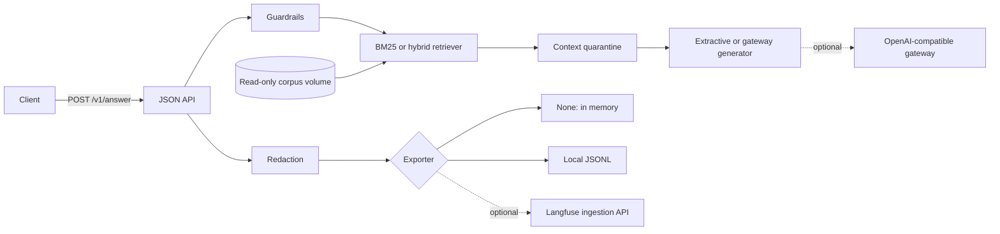

# Threat model

Scope: the v0.2.0 service as shipped in this repository, run locally or through the compose profiles. It covers the CLI, the JSON API, the education corpus adapter, the gateway client, and trace export. It does not cover a 9Router or Langfuse deployment, a public host, or TLS termination.

Alt text: a request passes guardrails, retrieval over a read-only corpus, a context quarantine, and a generator that may call an external gateway. Every trace passes redaction before one of three exporters.

## Assets

The corpus and its provenance (dataset slug, version, manifest hash), the gateway and Langfuse credentials held in the environment, and user questions, which may contain anything a visitor types.

## Threats and controls

| Threat | Control in this repository | Test | Residual risk |
|---|---|---|---|
| Direct prompt injection in the question | Pattern refusal after NFKC, case, whitespace, and zero-width folding | `tests/test_service.py::PromptInjectionTests` | Patterns cover known phrasing only; paraphrases pass |
| Indirect injection from a corpus passage | Retrieved chunks that match an injection pattern are withheld from generation and counted in the trace | `test_poisoned_passage_is_quarantined_before_generation` | Same pattern limit as above |
| Model cites evidence it was not given | Citations are parsed from model output and intersected with retrieved chunk ids; no valid citation means abstention | `tests/test_observability.py::GatewayGeneratorTests` | A model can cite a real chunk and still misstate it |
| Answer from weak evidence | Top chunk must cover at least 60% of query terms | `UnsupportedQueryTests`; abstention set in `evaluation.py` | An unknown entity plus common terms can pass (see evidence) |
| Tampered or unapproved corpus | Pin check, manifest SHA-256, per-file SHA-256 and size, privacy gate, column allowlist, person-level field block | `tests/test_education_corpus.py` | Files outside the manifest (Kaggle README) are ignored, not verified |
| Question or answer text leaking to traces | Question is always hashed; passage and answer text are dropped unless `--trace-include-content` is set; credential-like metadata keys are removed | `tests/test_observability.py::RedactionTests` | Chunk ids and scores are exported and reveal which documents were relevant |
| Credential exposure | Keys read from the environment at call time, never stored on clients or attempt records, never baked into the image; CI scans for key patterns | `test_attempt_records_never_contain_the_key` | A filled `.env` on the host is outside the repository's control |
| Request floods and oversized bodies | 16 KiB body limit, 1000-character question limit, strict JSON schema | `tests/test_api.py` | No rate limiting or authentication; do not expose the API publicly as is |
| Container escape or host write | Non-root UID 10001, read-only root filesystem, read-only corpus mount, dropped capabilities, `no-new-privileges`, ports bound to 127.0.0.1 in compose | Manual run recorded in `docs/evidence/` | Host hardening is out of scope |
| Observability outage blocking answers | Export errors are caught, counted, and logged by type only | `test_export_failure_does_not_block_the_answer` | Traces are lost during an outage |

## Out of scope

Authentication, rate limiting, TLS, public ingress, gateway OAuth handling, Langfuse retention settings, and any deployment beyond a local machine. The public demonstration profile in the runtime repository owns those.
